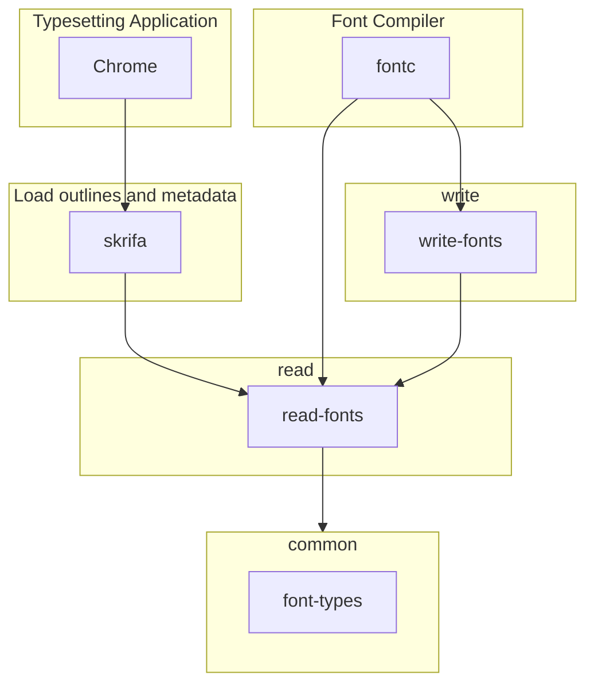

# oxidize

Wherein we contemplate moving shaping, rasterization, font compilation, and general font inspection and manipulation from Python & C++ to Rust.

## Table of Contents

- [Why](#why)
- [Goals](#goals)
   - [Support both our primary usage patterns](#support-both-our-primary-usage-patterns)
   - [Offer memory safety for text rendering](#offer-memory-safety-for-text-rendering)
   - [A productive codebase](#a-productive-codebase)
   - [Prefer incremental delivery, early production use](#prefer-incremental-delivery-early-production-use)
- [Definitions](#definitions)
- [Where is the code?](#wheres-the-code)
- [References](#references)    
   - [Internal](#internal) - references within this repository
   - [External](#external) - references outside this repository

## Why

We currently rely C++ for anything high performance, e.g. shaping or subsetting, and Python for general purpose manipulation. The results are exactly what you'd expect:

* Python code (fonttools, fontmake, nanoemoji, etc) have high development velocity, relatively fast developer rampup, and runtime safety, slow runtime
   * It's SO slow that running it in production at scale causes us great pain. Queues back up, we burn memory and CPU, and it just doesn't fit our infra all that well.
* C++ code (HarfBuzz) has fast runtime, very slow development velocity, very slow developer rampup, and any safety it might have is due to extensive fuzzing
   * It's entirely normal to make a seemingly safe change and then see a stream of fuzzer bugs
   * Best thing ever in production, blindingly fast and low resource cost, fits infrastructure nicely. But scary due to lack of safety.

Some logic ends up implemented in both languages. For example, when it became apparent the Python subsetter was too slow for both runtime serving and future projects like [progressive font enrichment](https://www.w3.org/TR/PFE-evaluation/) the [hb-subset](https://goo.gl/Qy3Eqc) project was born.

Rust appears to offer us the ability to implement fast, safer code with development velocity in between Python and C++. This is a very appealing offer.

## Goals

Our priorities, higher priority items first, are:

| What | Why |
| --- | --- |
| Minimal or no unsafe, fast, memory-efficient | If it's not fast enough or it hogs memory nobody will ship it. We would accept unsafe - that we can convince ourselves to be safe - if it got us substantial perf. We're not specifically aiming for `#![forbid(unsafe_code)]`, though it would be nice. |
| Ergonomic, hackable | Ergonomic: friendly to consumers, idiomatic wherever possible. Hackable: friendly to developers modifying the code |

Taken from discussion [here](https://github.com/googlefonts/oxidize/issues/10#issuecomment-1024769804).

### Support both our primary usage patterns

1. Performance-critical read-only users (shaping, rasterization)
   * HarfBuzz and FreeType have *years* of performance optimizations. A replacement that is significantly slower will not land.
1. Read/write use (compilers, utilities)
   * Performance is less critical here. We don't want to be *slow*, but we don't need the level of performance obsession shaping needs either.

For read-only users we may need to support readonly mmap access. Crates like zerocopy and the like suggest this is possible. Establishing a clean pattern here should be tackled early. https://github.com/googlefonts/oxidize/pull/3 proposes a path forward.

### Offer memory safety for text rendering 

Chrome and Microsoft both observe that:

1. 70% of high severity security bugs are memory safety issues ([Chrome](https://www.chromium.org/Home/chromium-security/memory-safety), [Microsoft](https://msrc-blog.microsoft.com/2019/07/18/we-need-a-safer-systems-programming-language/))
1. Rust _may_ help
   * If it can [play nice with C++](https://security.googleblog.com/2021/09/an-update-on-memory-safety-in-chrome.html)
   * For Fonts we can, if necessary, limit ourselves to stable C ABI

A safe text stack is desirable for Chrome, Android, and more. At time of writing we observe a semi-steady stream of fuzzer issues. It seems plausible a Rust rewrite can stop the bleeding. This is promising enough it's well worth giving it a try!

HarfBuzz is the primary target. Some parts of FreeType used in Chrome and Android may also need to be replaced. If we do both the stream of fuzzer issues _should_ stop.

### A productive codebase

We seek to provide a developer friendly codebase. For example, exploration of new structs for something COLRv1 should be readily achievable by forking and hacking around. That means the code needs to be simpler than today's C++ and as close as possible to Python level development velocity. To achieve this we will seek to establish an efficient pattern to support our two primary usage patterns. This will require that we:

   * Stay DRY
      * Don't hand-write things twice, once for high performance readonly access and once for mutable access
      * Don't hand-write per-field parsing (struct.blah = read type of blah, etc)
         * It's OK to *occasionally* hand-write, particularly for some of the more obtuse parts, but it should be the exception not the rule 
         * Try to continue the HarfBuzz and FontTools style of declaring the shape of things and letting automation take over wherever possible
      * Automated authoring, such as by macro or build time tooling is acceptable
   * Minimize unsafe code
   * Invest in testing

### Prefer incremental delivery, early production use

We will _prefer_ to:

* Make incremental progress, with each milestone being used in production, rather than spend years with parallel increasingly divergent implementations.
* Test the Rust implementation against the non-Rust implementation for both correctness and performance
   * This has been very successful to enable replacement of Python subsetting with hb-subset
* Fail-fast, if rebuilding in Rust is infeasible we would like to know ASAP
   * Given the results of projects like piet-gpu and swash we currently believe the effort very feasible

## Getting started

Updated 8/16/2024. Our first phase projects are:

1. [Skrifa](https://docs.rs/skrifa), replace FreeType for querying metrics, loading outlines, autohinting, and executing hints
   * https://chromestatus.com/feature/5717358869217280 tracks the Chrome status
   * Google typically uses Skia to rasterize so we don't implement that in Skrifa
1. [fontc](https://github.com/googlefonts/fontc), meant to replace [fontmake](https://github.com/googlefonts/fontmake)
   * https://googlefonts.github.io/fontc_crater/ tracks progress in getting the compilers to match

The next phase is:

1. [skera](https://github.com/googlefonts/fontations/tree/main/skera), meant to be a memory safe replacement for [hb-subset](https://harfbuzz.github.io/harfbuzz-hb-subset.html) and [fonttools subset](https://fonttools.readthedocs.io/en/latest/subset/)
   * Google Fonts depends heavily on subsetting
1. [harfruzz](https://github.com/harfbuzz/harfruzz), meant to replace HarfBuzz [shaping](https://harfbuzz.github.io/what-is-harfbuzz.html)

Both phases build on core read/write fonts work in https://github.com/googlefonts/fontations.

## Definitions

### zerocopy

The direct reading/writing of scalars and, wherever possible, aggregates (structs and slices) through reinterpretation of pointers to raw bytes in memory.

## Where's the code?

The graph below depicts, and links to (*warning* copy the links rather than clicking on them until https://github.com/community/community/discussions/17545 resolves), active projects and their relationships (arrows indicate dependency):

## References

### Internal

References within this repository.

* [Simon Cozens parallel font compilation experiments](text/2022-05-10-parallel-font-compile-experiments.md)

### External

* [Oxidize Introduction](https://docs.google.com/presentation/d/1kLB_BY7nSzNo07NrpvyJMxixGd4ULQTEEXjyO4KKM-E/edit?usp=sharing) slides from @cmyr on progress as of October 2022
* https://github.com/drott 2023 BlinkOn [Safe and sound Rust Font Stack ](https://docs.google.com/presentation/d/1Vp8VOXbsw67mOleJTq0bYORNxkTwYpVh9F_7PS9IK5I/edit?usp=drivesdk) presentation
* [HarfBuzz](https://github.com/harfbuzz/harfbuzz) is a world class high performance text shaper that makes extensive use of zerocopy-style access. In contemplating converting it to Rust there are a few key references to help in understanding the source:
   * hb-subset [design doc](https://goo.gl/Qy3Eqc)
      * Table packing (the hard part!) [design doc](https://goo.gl/bHvnTn) 
      * [Serialization](https://github.com/harfbuzz/harfbuzz/blob/main/docs/serializer.md) explains how graphs are handled during subsetting
      * [Repacker](https://github.com/harfbuzz/harfbuzz/blob/main/docs/repacker.md) explains how layout tables are packed
* https://security.googleblog.com/2021/09/an-update-on-memory-safety-in-chrome.html offers commentary on the feasibility of having Rust-like safety in C++
* https://pngquant.org/rust.html offers an interesting example of a Rust migration of a small library
* http://dtrace.org/blogs/bmc/2018/09/28/the-relative-performance-of-c-and-rust/ another interesting example
* https://wiki.mozilla.org/Oxidation
* https://blog.cloudflare.com/how-we-built-pingora-the-proxy-that-connects-cloudflare-to-the-internet/

