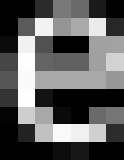
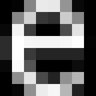

 # The value of autohinting on high resolution displays

_A short exploration of the relationship between pixel density and hinting._

## The basics

_Pixel density_, a measurement of resolution, refers to the number of pixels
packed into a given physical area of a display, typically measured in pixels
per inch or PPI. 

_Autohinting_ is the process of adjusting a scalable glyph outline (at runtime)
so that the edges are aligned with pixel boundaries. The purpose is to increase
contrast and improve readability by increasing the pixel coverage for each
visual feature of the outline. See [autohinting](2025-01-27-autohinting.md) for
a more detailed explanation of hinting and autohinting.

Since pixel density determines the number of pixels available to represent
a particular visual feature, it stands to reason that the benefit of
hinting (auto- or otherwise) is _inversely proportional_ to the pixel density
of the target display. Therefore, we can assume that, at some density, the
benefit outweighs the cost.

## Motivation: the cost of autohinting

As might be ascertained from the autohinting document linked above, the cost
of generating and applying hints at runtime can be significant in both time
and space.

For complex variable fonts like [Roboto Flex](https://fonts.google.com/specimen/Roboto+Flex),
processing variations takes substantial time which hides some of the autohinting
cost and the overhead is roughly 100%. For the simpler, non-variable
[Roboto](https://fonts.google.com/specimen/Roboto), the time to render an
autohinted glyph can be as much as **10 times** that of an unhinted glyph.

Autohinting also requires memory allocations. The cost of the shared state is
proportional to the number of glyphs in the font and the cost for each
glyph is proportional to the outline complexity.

## When is hinting worth the cost?

This question is ultimately one of perception, so it makes sense to consider
a visual example with various renderings of a single character to simulate
a range of pixel densities.

We'll take a look at the lowercase _e_ from the [Roboto](https://fonts.google.com/specimen/Roboto)
font at a reasonable body text size of 14 for this example. The following table
shows renderings of this character, unhinted and hinted, for various pixel
densities.

> These pixel density qualifiers are taken from _Table 1_ at the 
 [Android pixel density documentation](https://developer.android.com/training/multiscreen/screendensities#TaskProvideAltBmp).

|  | 160 PPI (baseline) | 240 PPI (high) | 320 PPI (extra high) | 480 PPI (extra-extra high) |
|--|---------|---------|---------|---------|
| Unhinted |  |  |  |  |
| Hinted |  |  |  |  |

It's quite obvious that the _baseline_ density (or anything less) really requires
hinting. The lower stem of the [counter](https://fonts.google.com/knowledge/glossary/counter)
in the unhinted rendering has very little contrast leading to a washed out
appearance and the character will appear blurry at actual size. Conversely,
the _extra-extra high_ density receives no benefit from hinting. Arguably,
the unhinted version better represents the original intent of the font designer.

The _high_ and _extra high_ densities are not as clear cut. The unhinted
renderings both have sufficient contrast. Whether hinting is required at these
densities is perhaps a matter of taste.

## Conclusions

It's clear that, for currently available devices, a threshold _does_ exist where
the cost of autohinting outweighs the benefit. Where to draw that line is not
entirely obvious, however, and might benefit from user testing to determine the
perceived cutoff in actual use.
